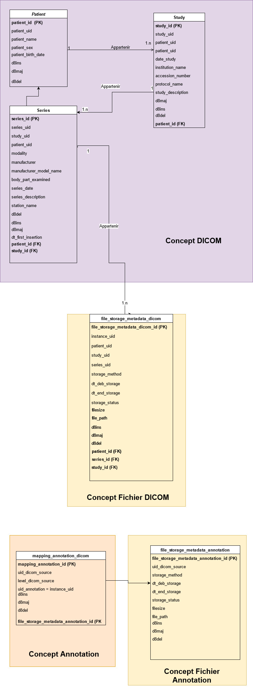

.. _database:

Database
========

Liste des tables
----------------

Sphere
~~~~~~

- patient:
    Table patient qui contient la liste de tous les patients.
- study :
    Table study qui contient la liste de tous les study
- series:
    Table series qui contient la liste de tous les séries
- file_storage_metadata_dicom:
    Table file storage metadata dicom qui nous informe où se trouve le fichier DICOM (instance)

    Valeur possible de **storage_method**: FS ou HDFS
    Valeur possible de **storage_status**: 0 ou 1 (0 = stockage ok; 1 = échec du stockage)

Annotation
~~~~~~~~~~

- file_storage_metadata_annotation:
    Table file storage metadata annotation qui nous informe où se trouve le fichier annotation

- mapping_annotation_dicom :
    La table de mapping entre uid_dicom (c'est à dire le
    **SeriesInstanceUID** ou **SeriesInstanceUID** selon le level de l'annotation)
    et la table **file_storage_metadata_dicom**

Diagramme de classe de toutes les tables
----------------------------------------

Extended database
-----------------

Pour ajouter des champs supplémentaires dans les quatres tables principales (patient, study, series, instance).
Voilà les liens ou tu peux trouver presque tous les tags `Data Elements`_, `File Meta Elements`_ et `Directory Structuring Elements`_.

.. _Data Elements: http://dicom.nema.org/medical/dicom/current/output/chtml/part06/chapter_6.html
.. _File Meta Elements: http://dicom.nema.org/dicom/2013/output/chtml/part06/chapter_7.html
.. _Directory Structuring Elements: http://dicom.nema.org/dicom/2013/output/chtml/part06/chapter_8.html"

1 - Il faut ajouter les tags DICOM dans le fichier `tags.yml` qui existe dans le dossier `app`

Exemple du fichier tags.yml::

    patient:  # Ajoute la liste des tags pour la table patient
        - '00101020'
        - ...
    study:  # Ajoute la liste des tags pour la table study
        - '00080030'
        - '00409096,00409224' # if we have child tags. You must add the parent tags separate by comma.
        - ...
    series:  # Ajoute la liste des tags pour la table series
        - '00080031'
        - ...
    instance:  # Ajoute la liste des tags d'instance dans la table file_storage_metadata_dicom
        - '00080008'
        - ...

2 - Execute le programme `main_extended_db.py` et lui il va modifier ou le créer le fichier `extended_db.yml`

Dans le fichier `extended_db.yml` vous allez trouver tous les champs que vous allez ajouter pour chaque table.

Exemple d'ajout d'un champ dans la table patient avec le fichier extended_db.yml::

    patient:  # name of table (patient, study, series or instances)
        '00101020':  # tag of attribute name
            parents: # The parents tag if this tag '00101020' is child
            keyword: PatientSize  # keyword of attribute name
            value_representations: DS  # value representations
            field_name: patient_s_size  # field name in database
            type: String  # type of value (default String)
            size: 128    # size of value  (default 64)

3 - Lancer la commande `clean` ou `drop` et `create` pour créer les tables avce les champs extended

.. note::
    Comment répartir ces tags dans les différentes tables dans le fichier `tags.yml`?

    - Il faut voir si ce sont des tags lié au patient ou a la study ou a l'instance par exemple le poids du patient est lié au patient donc table patient le nombre de slice est lié à une serie donc dans la table series
    - les tags plus techniques comme la correction des pixels est lié à l'image donc a l'instance donc à mettre dans la table instance

PostgreSQL
----------

Définitions
~~~~~~~~~~~

* Cluster Machine > Cluster PG > Database > Rôles / Schémas > Tables > Champs
* Cluster Machine : plusieurs machines communiquants entre elles avec de la réplication
* Cluster PG : instances avec allocation de ressources spécific et définition de configuration
* Database : ensemble de données structurées (une application par exemple)

* Rôles/Users : utilisateurs avec login et mot de passe
* Schéma : Namespace ou espace de nom dans une base de données (un groupe d'éléments)
* Tables : espace de stockage logique dans une base de données
* Champs : une colonne de tables
* Lignes : une table est structurée en colonne/ligne

Installation
~~~~~~~~~~~~

- Installer PostgreSQL::

    $apt-get install postgresql-11

- Gestion le service ``postgresql`` via système D::

    service postgresql status
    service postgresql stop
    service postgresql start
    service postgresql reload

- Principaux répertoires

    * **configuration :** /etc/postgresql/<version>/main/
    * **datas :** /var/lib/postgresql//
    * **binaire principal :** /usr/lib/postgresql/<version>/bin/postgres
    * **binaires pg :** /usr/bin/ (pg_*)

Créer un utilisateur et base de donnée pour PostgreSQL
~~~~~~~~~~~~~~~~~~~~~~~~~~~~~~~~~~~~~~~~~~~~~~~~~~~~~~

Par défaut, PostgresQL crée un utilisateur ``postgres`` avec le rôle ``postgres``.
Il crée également un compte système portant le même nom «postgres».
Donc, pour vous connecter au serveur Postgres, connectez-vous à votre système en tant qu'utilisateur postgres et connectez la base de données.

.. code-block:: shell

    $sudo su - postgres
    $psql

Configurez PostgreSQL pour qu'il soit accessible par vos utilisateurs normaux.
! ``your_username``: choisissez votre_username avec votre utilisateur réel déjà créé sur votre système Ubuntu.

.. code-block:: shell

    postgres-# CREATE ROLE your_username WITH LOGIN CREATEDB ENCRYPTED PASSWORD 'password';
    postgres-# \q

Puis basculez vers le compte utilisateur et exécutez la commande **createdb** suivie du nom de la base de données. Cela créera une base de données sur PostgreSQL.

.. code-block:: shell

    $su - your_username
    $createdb my_db

Connectez-vous à Psql avec votre utilisateur linux ::

    PGPASSWORD='password' psql -U your_username  -d my_db

Connectez-vous à Psql avec un autre utilisateur::

    PGPASSWORD='password' psql -h 127.0.0.1 -p 5432 -U user -d my_db

Créer un schéma ::

    my_db=> CREATE SCHEMA my_schema;
    my_db=> \q

Accéder à une base de donnée::

    psql -d <your_database>

- Affichier liste des tables dans une schema:

    * Accéder à la base de donnée
    * lancer la commande ci-dessous

    .. code-block:: shell

        \dt my_schema.*

Quelques commandes
~~~~~~~~~~~~~~~~~~

Wrappers : équivalent de commandes sql

* createdb :
    - création d'une base de données
* dropdb :
    - suppression d'une base de données
* createuser :
    - création d'un utilisateur
* dropuser :
    - suppression d'un user

Maintenant, dans Psql, vous pouvez exécuter des commandes telles que:

    - ``\?`` lister toutes les commandes
    - ``\l`` liste des bases de données
    - ``\l+`` lister les databases Rq: + > volumétrie
    - ``\du`` lister les users
    - ``\dt+`` lister les tables
    - ``\dn`` lister les schémas
    - ``\dS <nom_table>`` lister les champs d'une table
    - ``\conninfo`` affiche des informations sur la connexion actuelle
    - ``\c [DBNAME]`` se connecter à une nouvelle base de données, par exemple, ``\c template1``
    - ``\dt`` liste les tables du schéma public
    - ``\dt <schema-name>.*`` liste les tables de certains schémas, par exemple ``\dt public. *``
    - ``\dt *.*`` liste les tables de tous les schémas
    - Ensuite, vous pouvez exécuter des instructions SQL, par exemple, ``SELECT * FROM ma_table;`` (Remarque: une instruction doit se terminer par un point-virgule``;``)
    - ``\q`` quitte psql

.. note::
    N'oubliez pas de modifier le fichier settings.yml, de la configuration de la base de données.

Sqlite
------

Installation
~~~~~~~~~~~~

Pour installer SQLite3, installez le paquet sqlite3.

.. code-block:: shell

        sudo apt-get install sqlite3

Lancer le terminal SQLite
~~~~~~~~~~~~~~~~~~~~~~~~~

Dans un terminal, lancer la commande suivante avant de taper les commandes propres à SQLite:

.. code-block:: shell

        sqlite3

Administration graphique pour PostgreSQL
----------------------------------------

- Installer docker : sudo apt install docker.io
- Configurer le proxy de docker
- Laner docker avec l'image de pgadmin : sudo docker run --rm -p 127.0.0.1:5050:5050 thajeztah/pgadmin4
- Vusialiser la base avec le gestionnnaire de la base de données http://127.0.0.1:5050/browser